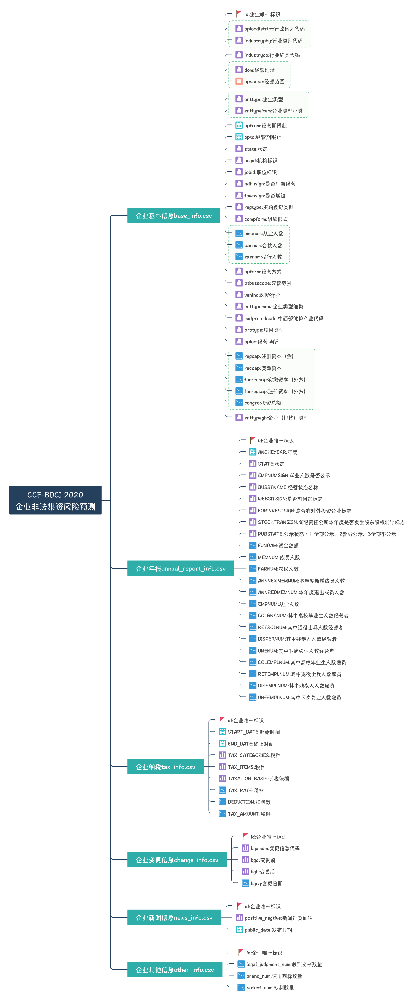
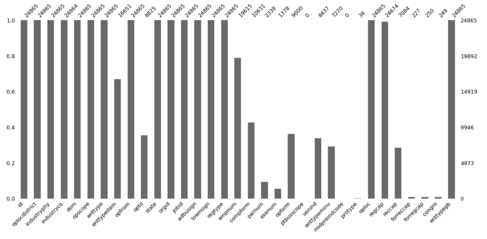
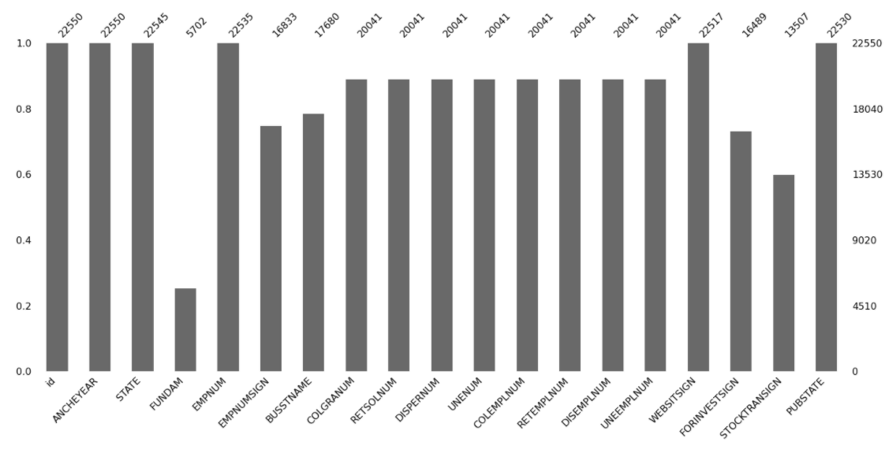
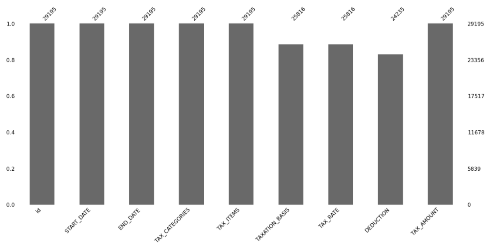
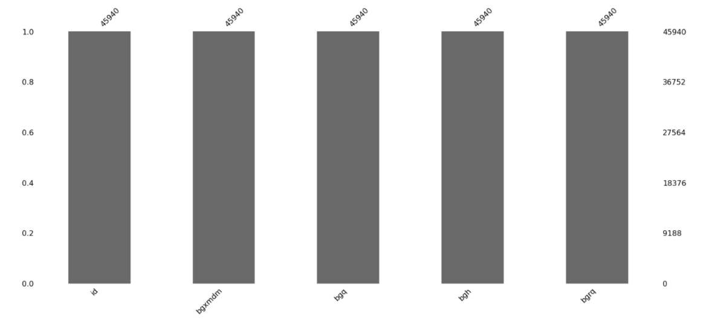
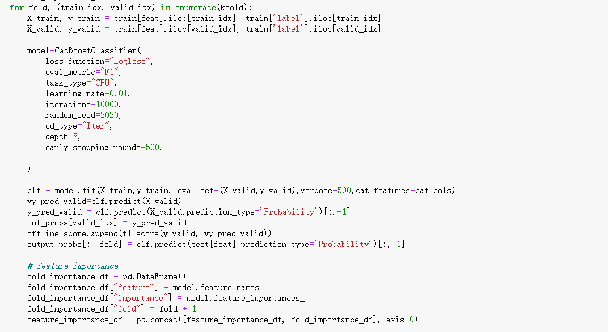
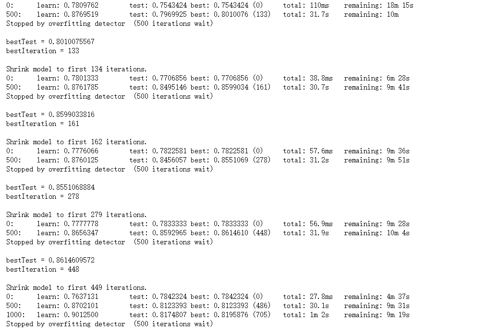
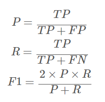

### 目录结构

```
├── #原始数据集
│   ├── entprise_evaluate.csv
│   ├── entprise_submit.csv
│   ├── train
│       ├── annual_report_info.csv
│       ├── base_info.csv
│       ├── change_info.csv
│       ├── entprise_info.csv
│       ├── news_info.csv
│       ├── other_info.csv
│       └── tax_info.csv
│  
├── feature # 特征工程中间文件
│   ├── cat_cols.json 
│   ├── test.csv 
│   └── train.csv 
├── importance.csv 
├── result # 提交结果
│   └── cat_sub.csv 
└── siriyang_catboost_baseline.ipynb
└── siriyang_catboost_baseline.py
```

### 环境配置说明

- numpy
- pandas
- matplotlib
- lightgbm
- catboost

### 实现训练的流程

1. 数据观察

   - 思维导图

     

   - base_info：所有企业的基本信息。

     

   - annual_report_info：企业的年报基本信息。

     

   - tax_info：企业的纳税信息。

     

   - change_info：企业的变更信息。

     

   - news_info：企业的新闻舆情信息。

   - other_info：企业的其他信息。

2. 数据特征提取

   ~~~text
   id
   base_oplocdistrict
   base_industryco
   base_enttype
   base_enttypeitem
   base_state
   base_orgid
   base_jobid
   base_adbusign
   base_townsign
   base_regtype
   base_empnum
   base_compform
   base_parnum
   base_exenum
   base_venind
   base_enttypeminu
   base_protype
   base_regcap
   base_reccap
   base_forreccap
   base_forregcap
   base_congro
   base_enttypegb
   base_industryphy_id
   ~~~

3. 模型训练代码块

   

   

4. 评价指标

   

### 代码运行

- 使用jupyter notebook进行代码运行 siriyang_catboost_baseline.ipynb
- 使用cmd进行 python siriyang_catboost_baseline.py